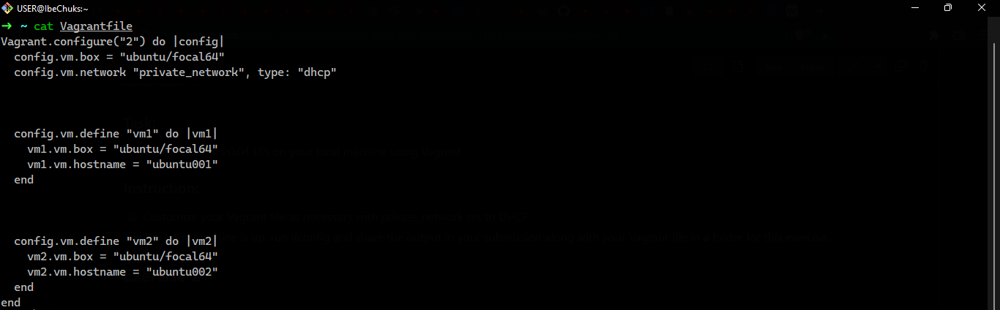
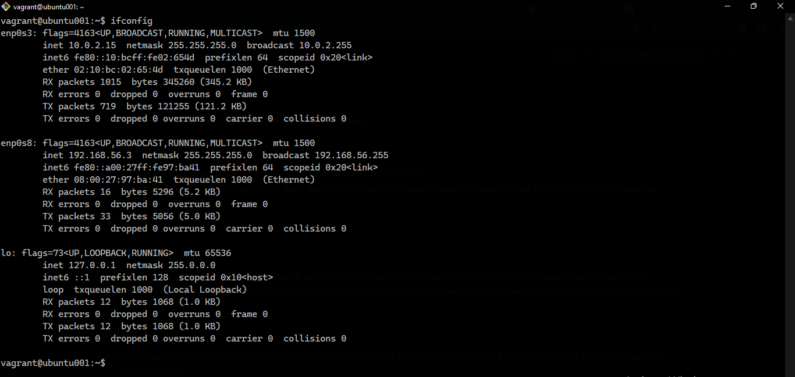

# Excercise 1

### Exercise-1-0
This shows the customization of my Virtual Machine via its Vagrantfile to work with a private network.


You will get the content of the VMs' Vagrantfile by running the command:

```
 cat Vagrantfile
```


<br>

### Exercise-1-1
The image below shows the content of the VM when the ``` ifconfig ``` command is run; which shows the ip address generated for being configured to run on a private network.


<br>

