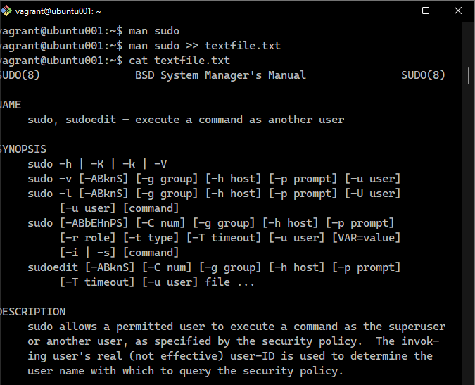
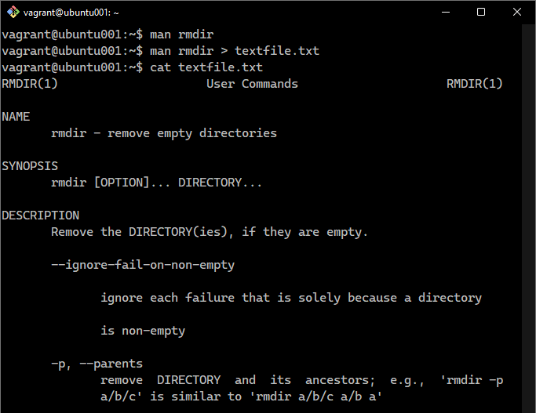
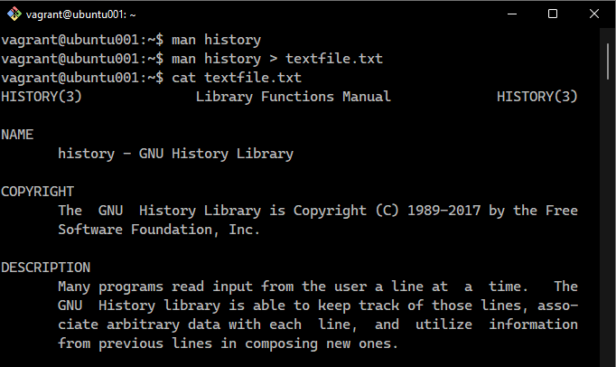
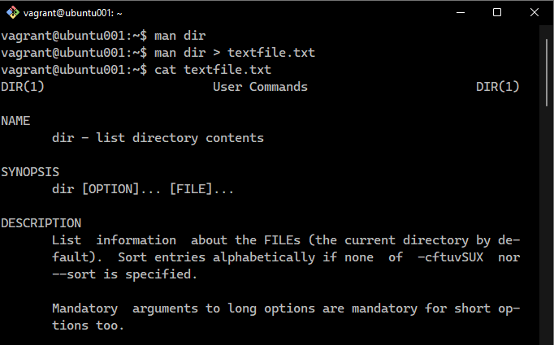
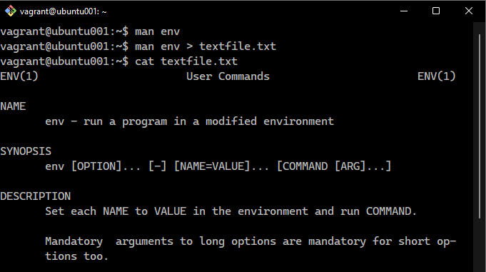
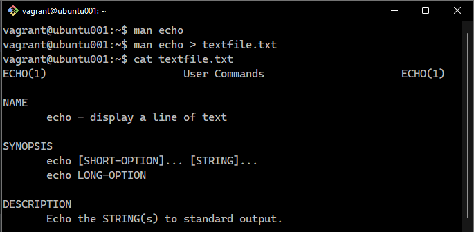
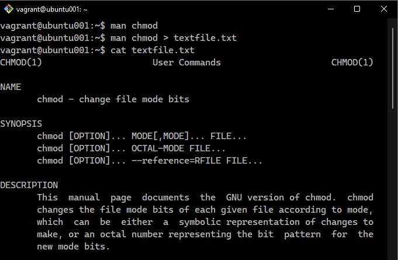
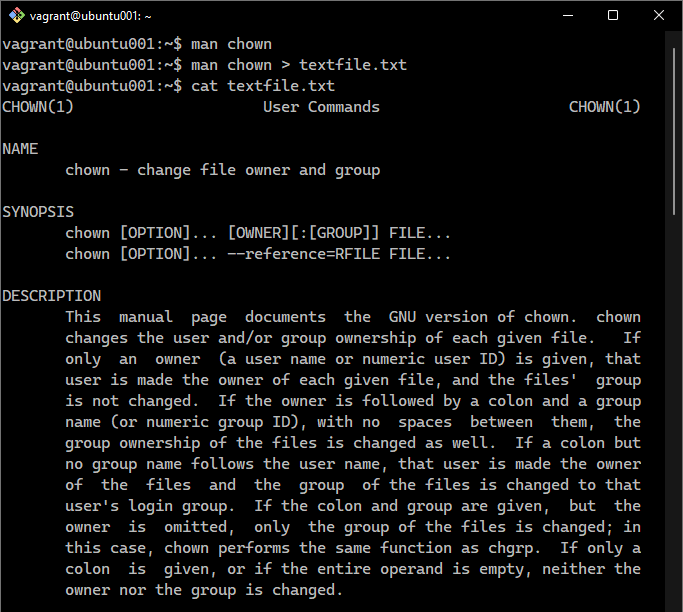
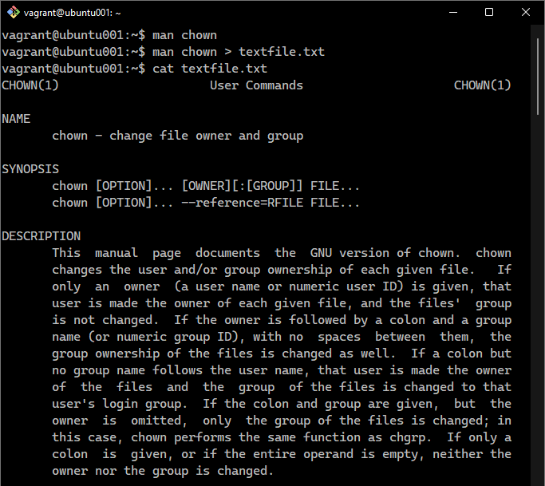
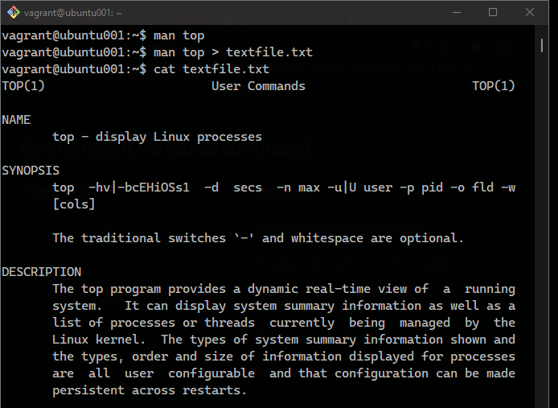

# Exercise 2
This Exercise shows, in screenshots, a list of 10 additional commands I learnt while studying the Linux OS. 

## Command 1

 

## Command 2

 

## Command 3

 

## Command 4

 

## Command 5

 

## Command 6

 

## Command 7

 

## Command 8

 

## Command 9

 

## Command 10

 