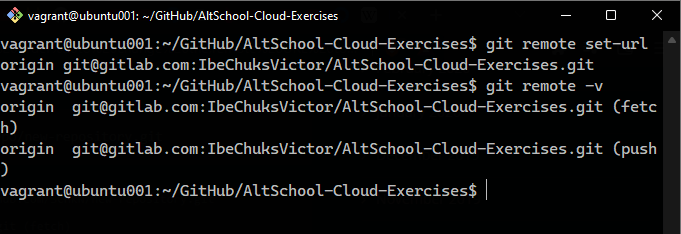
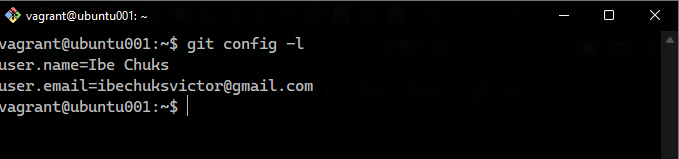
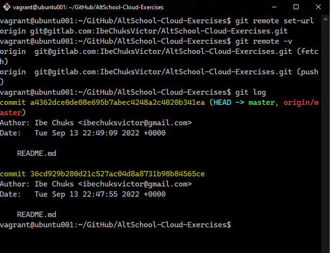

# Exercise 5

I learnt about git, GitHub and GitLab and how to switch between each version control platform on the CLI.

The command to run when switching is:
```
$ git remote set-url <remote name> <remote url>
```


<br>

I also leart how to configure the git environment on my VMs using these commands:
```
$ git config --global user.name <username>
$ git config --global user.email <emai address>
```


<br>

You can also see the list of commits you have made with this command:
```
git log
```


<br>

