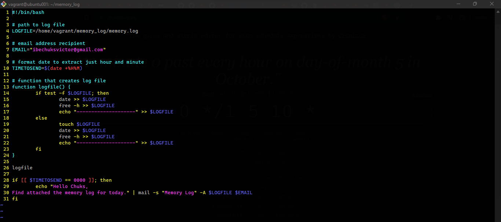
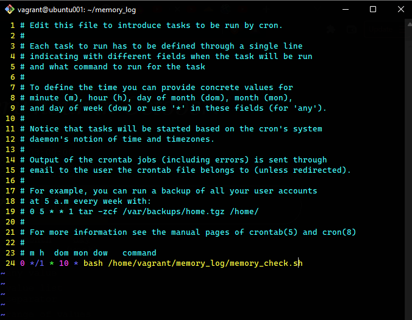
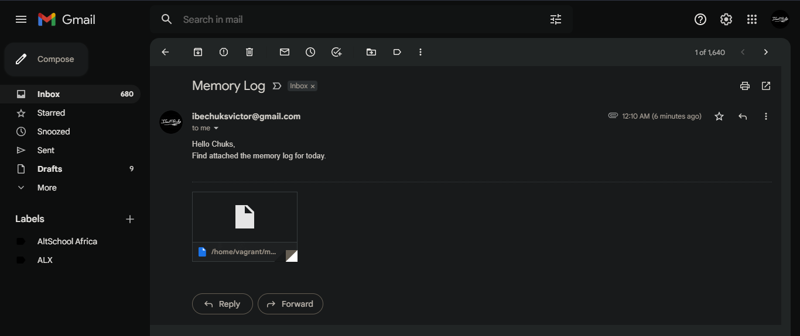

# Exercise 7

I learnt bash scripting, ssmtp and crontab.
This exercise helped solidify my knowledge of these concepts.

Below are screenshots of how I was able to achieve the creation of a bash script to run at every hour, saving system memory (RAM) usage to a specified file (memory.log) and at midnight it sends the content of the file to my email address.

### Bash script:

 

### Crontab:

 

### Content of the mail sent from the terminal using contrab, bash script and ssmtp
