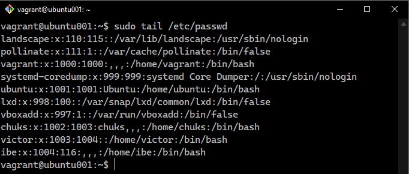
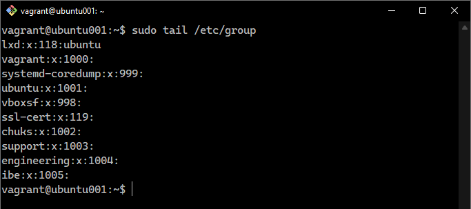
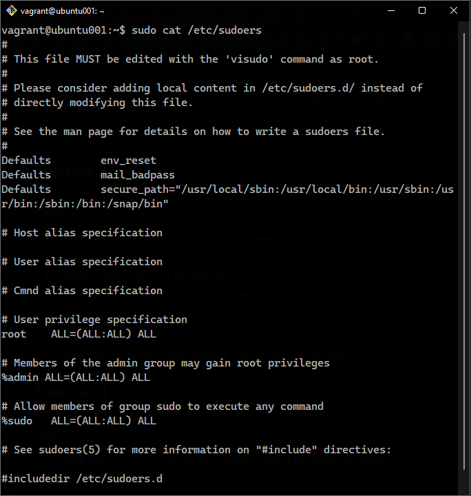

# Exercise 3

I created 3 groups with a user in each of the groups. 
- admin - ibe
- support - chuks
- engineering - victor

I added the admin group to sudoers

The screenshots below will shows content of these files `/etc/passwd`, `/etc/group` and `/etc/sudoers` respectively.

### /etc/passwd

 

### /etc/group

 

### /etc/sudoers

