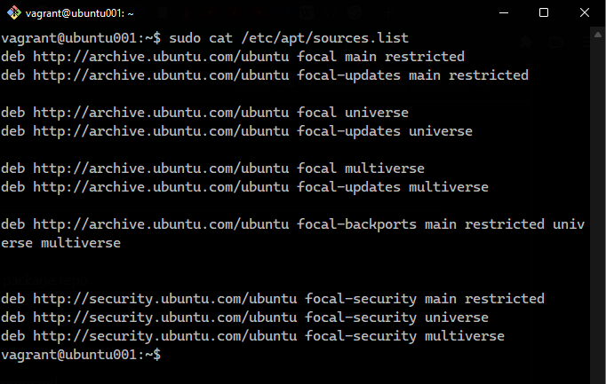
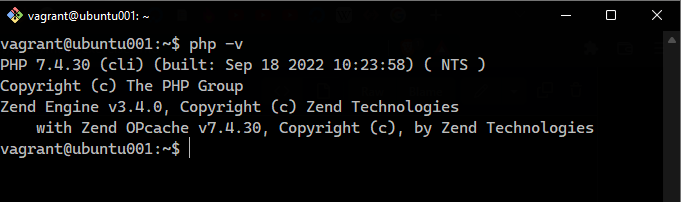

# Exercise 4

I learnt about package managers and used the knowledge i garnered to install php-7.4 is run.

Below are the screenshots, of the content of the file `/etc/apt/sources.list` and the output when the command `php -v`.

### /etc/apt/sources.list

 

### `php -v`

