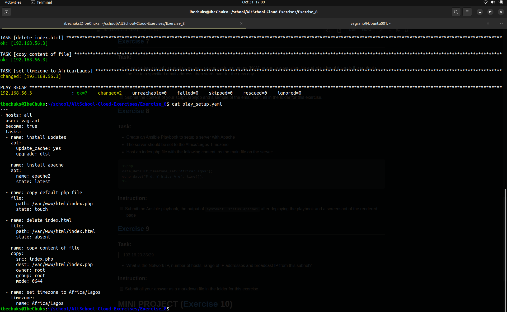
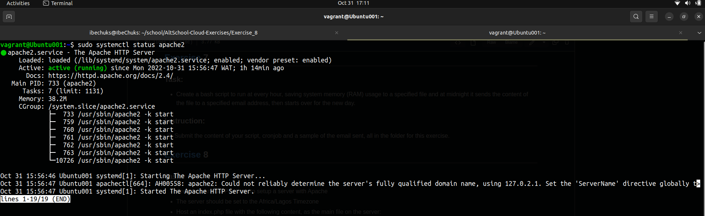
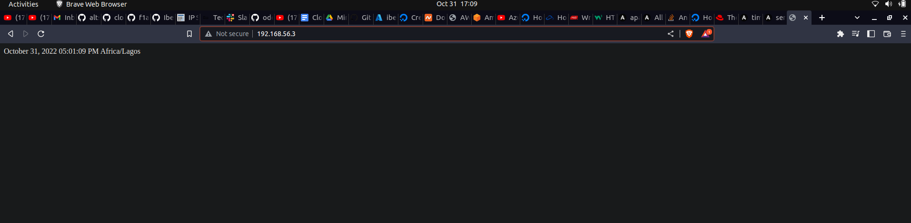

# Exercise 8
With this task we were taught configuration management using ansible.
I was able to configured a remote machine to the specification required by our instructor using Ansible from my local machine.

This is the content of the playbook:
<br>

<br>

To install using the playbook, you run this code:
```
    $   ansible-playbook -i inventory play_setup.yaml
```
Below shows the result of the service `apache2` installed in the remote machine using `ansible`.
<br>

<br>

Ansible can be used to do alot of things including updating the content of a web page in a remote machine. 

This is the rendered result of changing the content of the default `/var/www/html/index.html` apache2 web page to `var/www/html/index.php`:
<br>

<br>